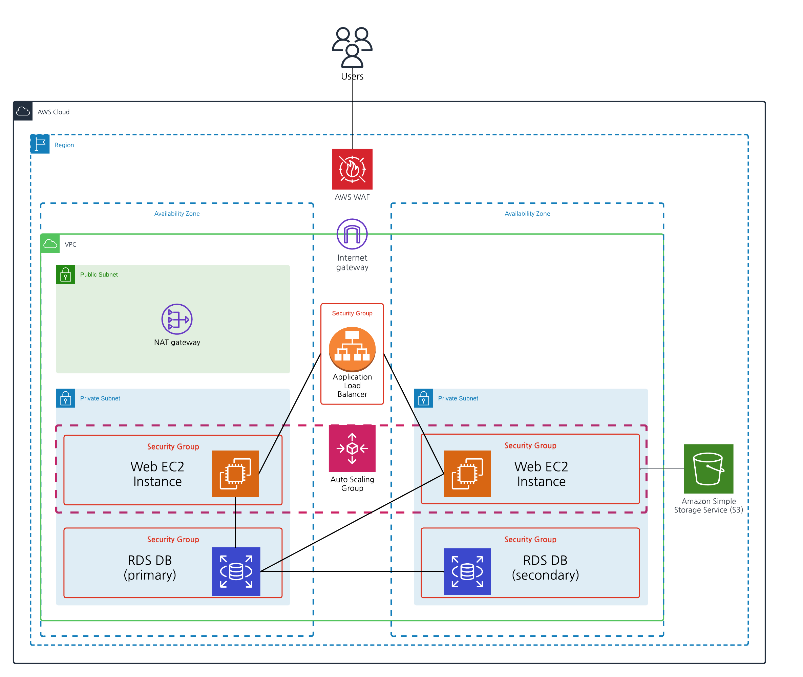
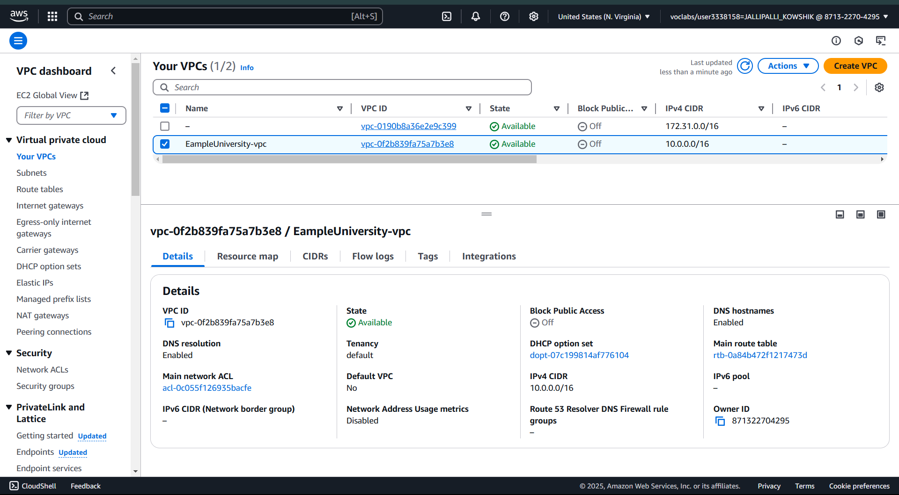
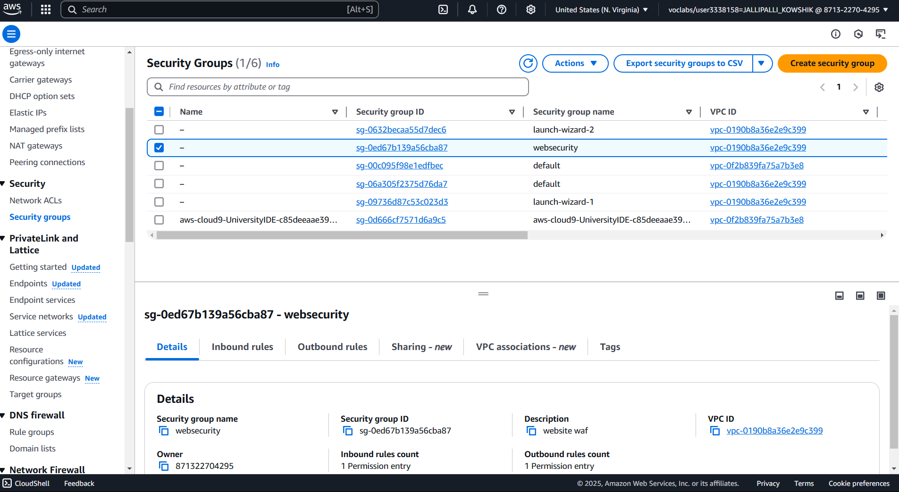

# AWS-Capstone-Project
This is documentation for building a highly available, scalable web application using AWS' cloud services for Example XYZ University.

### Infrastructure Prediction



I created this diagram before I actually started the build. This is the ideal infrastructure because it's secure. However, for a first time try, I learned throughout that it'll be easier to go simple.

### Cost Estimation
In this case, I have a monthly budget of $56 and am setting up a basic infrastructure that includes:  

- VPC  
- EC2  
- Load Balancer  
- Auto Scaling
  
A lot AWS' services have a free tier, so I went under the budget. Here is my estimated budget for the entire build using AWS Pricing Calculator:

[My Estimate - AWS Pricing Calculator.pdf](https://github.com/kowshikjallipalli0105/Building_a_Highly_Available_Scalable_Web_Application/blob/main/MyEstimate.pdf)

### Creating a VPC

The first step was to create a Virtual Private Cloud (VPC) named ExampleUniversity-vpc to host my infrastructure. This setup is deployed in a single region and utilizes two availability zones (us-east-1a & us-east-1b) for fault tolerance. The web application instance is hosted across two public subnets (public subnet 1 & public subnet 2).

Although the VPC includes private subnets, they are not used in this setup for simplicity. Implementing private subnets with a NAT gateway would enhance security, but it adds complexity, requires additional configuration, and increases costs.



Configuring the VPC Security Group
Once the VPC specifications were finalized, I created a VPC security group named Web Security Group.

- Within Inbound Rules, I allowed HTTP traffic from any IPv4 source, ensuring that web requests could reach the application.
- Using a custom security group instead of the default one provided greater control over the allowed protocols and communication settings for the web application.



### Launching an EC2 Instance
The next crucial component of the infrastructure was computing power. I started by launching an EC2 instance named University Lab Instance 1 in the us-east-1a availability zone.

- I selected the Ubuntu Amazon Machine Image (AMI).
- I chose the default t2.micro instance type and key pair since the university is small, and the free-tier options were sufficient for this scenario.
##### EC2 Configuration:
 - Networking Settings:
    - Enabled Auto-assign public IP to ensure external accessibility.
Assigned the instance to the Web Security Group to enforce the necessary security rules.
- Advanced Details:
   - Added Example University's website script in the User Data section to automate instance initialization.

```
#!/bin/bash -xe
apt update -y
apt install nodejs unzip wget npm mysql-server -y
#wget https://aws-tc-largeobjects.s3.us-west-2.amazonaws.com/CUR-TF-200-ACCAP1-1-DEV/code.zip -P /home/ubuntu
wget https://aws-tc-largeobjects.s3.us-west-2.amazonaws.com/CUR-TF-200-ACCAP1-1-79581/1-lab-capstone-project-1/code.zip -P /home/ubuntu
cd /home/ubuntu
unzip code.zip -x "resources/codebase_partner/node_modules/*"
cd resources/codebase_partner
npm install aws aws-sdk
mysql -u root -e "CREATE USER 'nodeapp' IDENTIFIED WITH mysql_native_password BY 'student12'";
mysql -u root -e "GRANT all privileges on *.* to 'nodeapp'@'%';"
mysql -u root -e "CREATE DATABASE STUDENTS;"
mysql -u root -e "USE STUDENTS; CREATE TABLE students(
            id INT NOT NULL AUTO_INCREMENT,
            name VARCHAR(255) NOT NULL,
            address VARCHAR(255) NOT NULL,
            city VARCHAR(255) NOT NULL,
            state VARCHAR(255) NOT NULL,
            email VARCHAR(255) NOT NULL,
            phone VARCHAR(100) NOT NULL,
            PRIMARY KEY ( id ));"
sed -i 's/.*bind-address.*/bind-address = 0.0.0.0/' /etc/mysql/mysql.conf.d/mysqld.cnf
systemctl enable mysql
service mysql restart
export APP_DB_HOST=$(curl http://169.254.169.254/latest/meta-data/local-ipv4)
export APP_DB_USER=nodeapp
export APP_DB_PASSWORD=student12
export APP_DB_NAME=STUDENTS
export APP_PORT=80
npm start &
echo '#!/bin/bash -xe
cd /home/ubuntu/resources/codebase_partner
export APP_PORT=80
npm start' > /etc/rc.local
chmod +x /etc/rc.local

```

For the other options when making the EC2 Instance, I kept default. Once the instance is launched, to check that the website is publicly accessible, I copied the IP address into a web browser. I knew it was successful when the web page popped up without any errors.


### Creating a Load Balancing

Even though the university is small, I wanted to ensure that the website remains accessible even during high traffic volumes. To achieve this, I set up an Application Load Balancer (ALB) to distribute traffic between instances across two availability zones.

 ###### Steps Taken:
1. Creating Another EC2 Instance
- Used the "Launch more like this" action on the first instance to replicate its configuration.
- Renamed the duplicated instance to University Lab Instance 2.
- Changed its availability zone to us-east-1b for redundancy.
2. Setting Up an Application Load Balancer (ALB)
- Created an ALB named ExampleUniversityLB.
- Selected us-east-1a and us-east-1b as the availability zones.
- Assigned the Web Server Security Group to control traffic.
- In the Listeners and Routing panel, created a new target group named albTG, which determines which instances will handle incoming requests.
  
For all other settings, I kept the default configurations.

### Creating an Auto Scaling

The final component of the infrastructure is Auto Scaling, which automatically creates new instances as needed to handle any surge in incoming traffic.

###### Steps Taken:
1. Creating a Launch Template
- Navigated to Create Launch Template.
- Enabled Auto Scaling guidance.
- Chose Ubuntu as the AMI.
- Set the Instance type to t2.micro.
- Selected the Key pair name as vockey.
- For the Subnet, I chose not to include it in the launch template.
- Configured the Advanced network settings:
- Enabled Auto-assign public IP.
- Assigned the Web Server Security Group.
-  Enabled Delete on termination for automatic cleanup.
- Created the Launch Template.
2. Creating the Auto Scaling Group
- Created an Auto Scaling Group named University Auto Scaling Group.
- Launched the previously created template.
- Set the Version to Latest.
- Selected ExampleUniversity-vpc for the VPC.
- Chose Public Subnet 1.
- Configured the Auto Scaling settings:
- Desired capacity: 1 instance
- Min capacity: 0 instances
- Max capacity: 4 instances

Created the Auto Scaling group and attached the instances to the group via Actions in the EC2 section.

To confirm the successful setup, I navigated back to the EC2 Instances page and verified that a new instance had been launched automatically.
### Testing 
To make sure that the infrastructure I created was correctly built, I needed to put the web application under heavy load to see if:
1. EC2 instances distributes traffic between availability zones (i.e. load balancing works)
2. New EC2 instances are created when a certain percentage in CPU utilization is crossed (i.e. auto scaling works)

To do this, I needed to create an environment that is attached to the VPC and the availability zones. I can then put that environment under stress and if everything is correct, it should distribute traffic to the previously made instances and create new ones if a certain threshold is crossed (I configured it to 60%-65%). 

**The steps I took to complete this:**
+ Navigated to AWS Management Console, chose Cloud9
    + Created an environment named UniversityIDE
    + Environment type: New EC2 instance
    + Instance type: t2.micro
    + Connection: Secure Shell (SSH)
    + VPC: ExampleUniversity-vpc
    + Subnet: Public Subnet 1
 
For the other options, I kept default.

After setting up the AWS Cloud9 environment, I performed a load test on the application by running scripts directly in the AWS Cloud9 terminal.
1. Install the Load Test Package:
    
     ```
     npm install -g loadtest
     ```
2. To simulate user traffic on the application, I ran the following command, replacing <LoadBalancerDNS> with the actual DNS name of the load balancer:
   ```
   loadtest --rps 2000 -c 1000 -k http://<LoadBalancerDNS>
   ```
   
Once I ran this command, I had to wait about 10-15 mins until I saw results (primarily auto scaling) because the CPU utilization had to cross a certain point. As it ran the script, it also popped up warnings, but it was fine to ignore them. 

To know that my infrastructure was built correctly, I navigated to the EC2 console and observed the amount of instances. I noticed that they increased in quantity. To observe the load balancing, I clicked on one of the instances and monitored the CPU utilization. All instances seemed to have the same amount of traffic, which means it did distribute the traffic between availability zones


### Final Infrastructure


**The final setup includes a scalable infrastructure with a VPC, EC2 instances in multiple availability zones, an Application Load Balancer, Auto Scaling, and a custom security group to ensure high availability and performance under varying traffic loads.**


